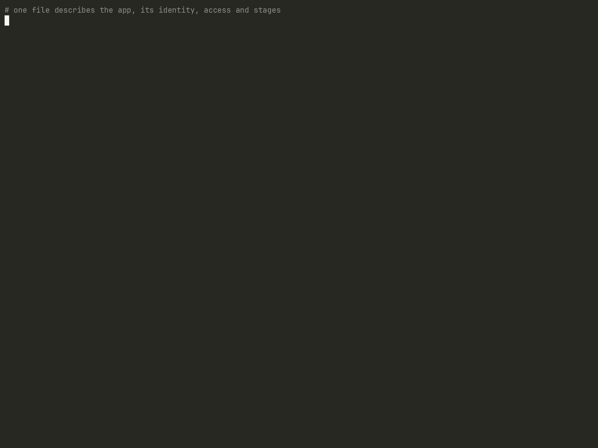

<div align="center">

<picture>
  <source media="(prefers-color-scheme: dark)" srcset="site/assets/runway-logo-dark.svg">
  
</picture>

**Cloud Run deployments from one file and one command.**

Build, identity, secrets, traffic and guardrails for Google Cloud Run,
described in a `runway.yaml` next to your code.

[](https://github.com/echaouchna/runway/actions/workflows/ci.yml)
[](LICENSE)

[Documentation](https://runway.echaouchna.dev/docs) ·
[Getting started](https://runway.echaouchna.dev/docs/getting-started/) ·
[Configuration](https://runway.echaouchna.dev/docs/configuration/) ·
[Changelog](CHANGELOG.md) ·
[Roadmap](docs/roadmap.md)

<a href="https://runway.echaouchna.dev/#demo"></a>

<sub>One file, then: the offline diagram, a first deploy, an exact plan, a preview URL per branch, a canary and pruning.
Cloud output uses sample names (<code>my-gcp-project</code>), waits are shortened.
<a href="https://runway.echaouchna.dev/#demo">Interactive player</a> (pause, copy text)</sub>

</div>

---

```yaml
# runway.yaml
version: 1
app: hello
provider:
  project: my-project
  region: europe-west1
  enable_apis: true
  create_build_resources: true
service:
  source: .                  # Dockerfile, or buildpacks when there is none
  service_account: "hello-run@${project}.iam.gserviceaccount.com"
  identity: { create: true }
  secrets:
    API_KEY: { secret: api-key }
stages:
  dev: {}
  prod:
    service: { min_instances: 1 }
```

```console
$ runway plan --stage dev      # exact diff against the live service
$ runway deploy --stage dev    # provision, build, roll out, wait until healthy
✓ hello-dev created in 74s
URL:      https://hello-dev-…-ew.a.run.app
```

## Why runway

Deploying to Cloud Run is easy once. Doing it well, every day, across
stages, usually means CI YAML for builds, Terraform for the service, IAM and
secrets, and shell glue between them. runway puts the **whole lifecycle of a
Cloud Run service** in one file and one tool:

- **One file, one command.** Image build, runtime identity and least-privilege
  grants, secrets, buckets, probes, scaling, IAP, tags and traffic.
- **No state file, no cluster.** runway reads the live project, changes only
  what differs, and is safe to re-run. An interrupted deploy resumes.
- **Exact plans.** `runway plan` shows field-level changes to the service,
  the image, the traffic split and every grant before anything happens.
- **A URL per branch, canaries on main.** `--preview $BRANCH` deploys without
  traffic; `--traffic 10` starts a canary; `runway traffic --promote` finishes it.
- **Secrets without the dance.** Declare a secret, runway creates it empty,
  grants who may fill it, and stops the deploy (with the exact command) until
  it has a value.
- **Built for real organizations.** Org-policy-friendly first deploys,
  service tags, IAP, impersonation and Workload Identity Federation for CI.

## How it works

<picture>
  <source media="(prefers-color-scheme: dark)" srcset="site/assets/how-it-works-dark.svg">
  
</picture>

Every step reads live state before making changes. An existing image skips
the build, and an interrupted deployment can be run again safely. The live
project is the state: no state file or cluster to maintain.

## Install

With [Homebrew](https://brew.sh) (macOS and Linux, arm64 and x86_64; bash,
zsh and fish completions included):

```sh
brew install echaouchna/tap/runway
```

Use the full name: `brew install runway` installs an unrelated app.
Upgrade with `brew upgrade echaouchna/tap/runway`. The latest build of `main`
is `echaouchna/tap/runway-edge` (uninstall one before installing the other).

Run the public container image:

```sh
docker run --rm ghcr.io/echaouchna/runway:edge runway --help
```

Binaries for Linux (glibc 2.35+) and macOS are attached to each
[release](https://github.com/echaouchna/runway/releases), with `SHA256SUMS`;
the [edge](https://github.com/echaouchna/runway/releases/tag/edge)
pre-release has those of the latest `main`.

Build from source with Rust 1.91 or newer:

```sh
# from GitHub
cargo install --locked --git https://github.com/echaouchna/runway runway

# from a local checkout
cargo install --locked --path .
```

`edge` (image, binaries and `runway-edge`) is the latest build of `main`, not
a release; tagged releases also publish versioned images.

runway uses [Application Default Credentials](https://cloud.google.com/docs/authentication/application-default-credentials):
`gcloud auth application-default login` locally, Workload Identity Federation
in CI. Shell completions are installed by Homebrew; otherwise
`runway completions bash|zsh|fish|nushell|xonsh|elvish|powershell` (see
[Shell completions](https://runway.echaouchna.dev/docs/getting-started/#shell-completions)).

## Quick start

```sh
runway init --app hello --project my-project   # runway.yaml + a runnable example
runway doctor --stage dev                      # credentials, APIs, permissions
runway deploy --stage dev
runway logs --stage dev --follow
```

Then read [Getting started](https://runway.echaouchna.dev/docs/getting-started/).

## Features

| Area | What you get |
|---|---|
| **Build** | Dockerfile or Google Cloud buildpacks on Cloud Build; content-addressed images (same source = no rebuild); base-image updates trigger rebuilds; release tags from your changelog |
| **Identity** | Runtime service account created on demand; roles on exactly one project, bucket, dataset, secret or repository; impersonation |
| **Secrets** | References as env vars or files; created empty with adders; deploy waits for values; new versions roll out with the next deploy |
| **Traffic** | Branch previews with their own URL, canaries, promote, explicit splits, rollback |
| **Guardrails** | Private by default, IAP, Resource Manager tags (service and project), org-policy-friendly bootstrap, ownership labels |
| **Platform** | API enablement, buckets, Artifact Registry, sidecars (any image) and an OpenTelemetry Collector sidecar, Cloud Storage volumes, HTTP probes |
| **Operations** | `plan`, `info`, `logs`, `describe` (ASCII/Mermaid), `undeploy` (keeps data), JSON output, stable exit codes, retries that understand IAM propagation |

See [Limitations and status](docs/limitations.md) for what runway does not
do yet and what has been verified against Google Cloud.

## How it compares

| | CI + Terraform | GitOps (Argo CD) | runway |
|---|---|---|---|
| What the app team maintains | CI YAML + HCL, often in several repos | CI + manifests + controllers' CRDs | one `runway.yaml` |
| Extra infrastructure | state buckets, Terraform pipeline | a Kubernetes cluster and controllers | none |
| Branch previews / canaries | build it yourself | possible, Kubernetes-centric | built in |
| Drift | next apply | continuously healed | next plan / deploy |

Terraform remains a good fit for shared platform resources (networks, load
balancers, DNS). runway focuses on the part that changes every day: the
Cloud Run application.

## Documentation

- [Getting started](docs/getting-started.md) · [Configuration](docs/configuration.md) · [Commands](docs/commands.md)
- [Previews, canaries and traffic](docs/traffic.md) · [Secrets](docs/secrets.md) · [CI/CD](docs/ci-cd.md)
- [Permissions](docs/permissions.md) · [How it works](docs/how-it-works.md) · [Undeploying](docs/undeploy.md)
- [Architecture](docs/architecture.md) · [Roadmap](docs/roadmap.md) · [Limitations and status](docs/limitations.md)

## Contributing

Contributions are welcome: bug reports, documentation, features. Read
[CONTRIBUTING.md](CONTRIBUTING.md) and the [code of conduct](CODE_OF_CONDUCT.md).
Security issues: see [SECURITY.md](SECURITY.md), please do not open a public issue.

## License

[Apache License 2.0](LICENSE). runway is not affiliated with or endorsed by
Google. Google Cloud and Cloud Run are trademarks of Google LLC.
